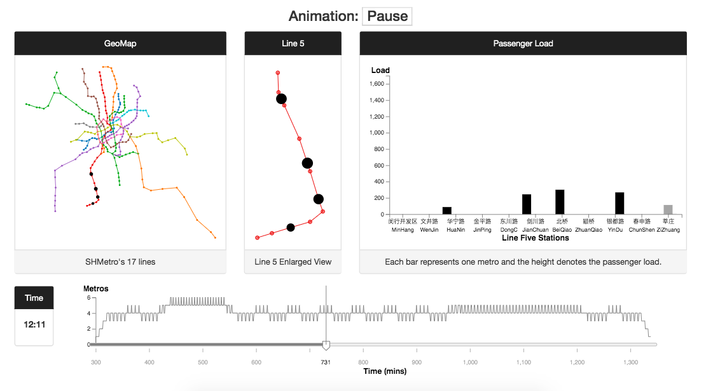
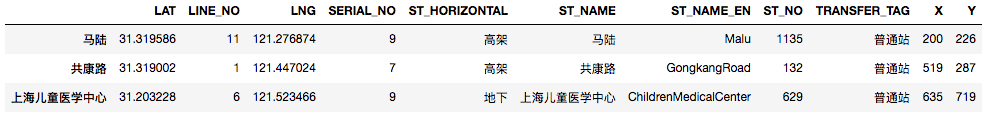
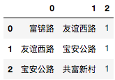
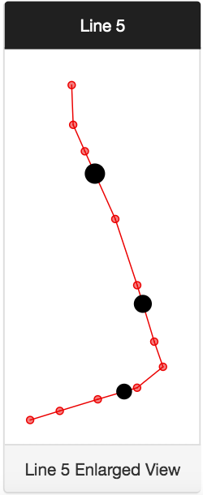
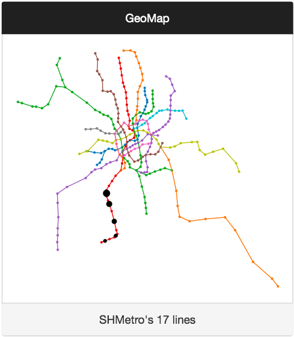
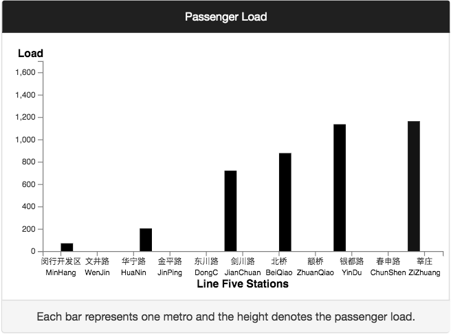
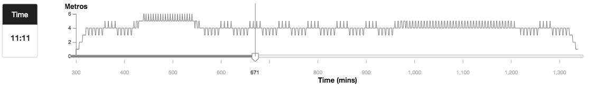

Assignment 4 - Visualizations and Multiple Views
===
Topic: ShangHai MTR Visualization
===

Working Link
----
https://yutinghan.github.io/04-MultipleViews/

Overview
----
This project visualizes one day of ShangHai MTR Line 5. There are four coordinated views as shown in Figure 1. 

- View-GeoMap shows 17 Metro lines on geomap and each circle denotes one metro running at this moment.
- View-Line5 is the enlarged view from View-GeoMap.
- View-Passenger-Load presents the passenger load on each metro at this moment. The X-axis denotes stations of Line 5 from the start to end and Y-axis denotes the passenger load, how many people on the metro.
- The left side on View-Time indicates time in 24-hours and the right side is a line chart. Here, X-axis denotes the time in minutes. For example, 300 means 5:00 am. And Y-axis denotes how many metros on Line 5 at this moment.

There are two modes, "animation play" and "animation pause". And the linked interactions are somewhat different in these two modes, which will be introduced later. 

<kbd></kbd> Figure 1

Data
----
- stations_by_name.json: The geolocations of each station are provided.

<kbd></kbd>

- connections_by_station_name.json: Connections between linked stations are provided.

<kbd></kbd>

- trains.json: The schedules on Line five is provided.

Four Views
----
- Line 5

  On Play-mode, circles indicating metros moves along Line 5. And when hovering on the circle, all animations on four views will pause and the corresponding metro in View-GeoMap and View-Passenger-Load will be highlighted as red circle and red bar. The moving timeline will also pause. When hovering out the circle, all animation will continue to play.

  On Pause-mode, linked interactions are the same as the Play-mode except for the pause effect.

  
<kbd></kbd>

  
- GeoMap
  
  View-GeoMap has the same linked interactions as View-Line5.
  
  
<kbd></kbd>

  
- Passenger Load

  On Play-mode, bars indicating metros moves along Line 5. And when hovering on the bar, all animations on four views will pause and the corresponding metro in View-GeoMap and View-Line5 will be highlighted as red circles. The moving timeline will also pause. When hovering out the bar, all animation will continue to play.

  On Pause-mode, linked interactions are same as the Play-mode except for the pause-effect and replay-effect.

  
<kbd></kbd>

- Timeline

  The slider on the View-Timeline could control animations of the other three views.
  
<kbd></kbd>

  

Technical Achievement Description
----
- Using Python(pandas) and Jupyter Notebook to clear data and export JSON files.
- Enter-Update-Exit is used to build animations.
- Time slider is used to control the animation process.
- When the time-slider moving to the end, it will return back to the start point automatically.

Design Achievement Description
----
- SHMTR geolocations are visualized.
- Four linked interactive views help users discover information by themselves.
  - Users could see the whole SHMTR map, a clear single view of Line 5, passengers' number on each metro and how time flies explained by the timeline.
  - On the Play-mode, users could explore links between each view without click "pause" button. Hovering on the circle or bar could achieve this effect. 
  - On the Pause-mode, users could explore details at this timestamp.
- Bootstrap layout is used.
  

Reference
----
- Data: https://github.com/jeevanyue/metro
- Slider: https://bl.ocks.org/johnwalley/e1d256b81e51da68f7feb632a53c3518

